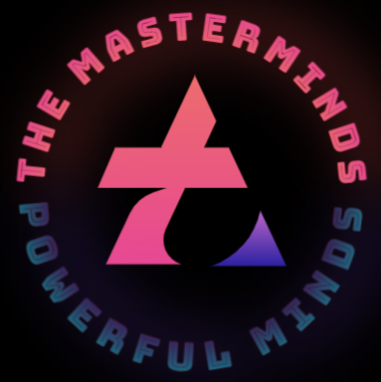
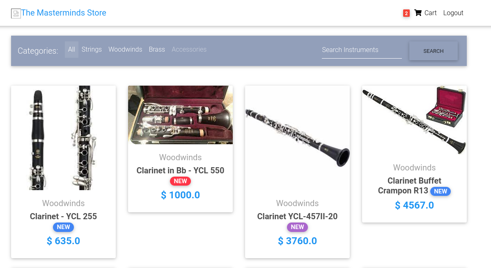

<p align="center">
  <p align="center">
    <a href="https://www.themasterminds.tech" target="_blank">
      
    </a>
  </p>
  <p align="center">
    An online music store
  </p>
</p>

---

# The Masterminds Store

This is a very simple e-commerce website built with Django.

## Quick demo

[]()

---

## Project Summary

The website displays products. Users can add and remove products to/from their cart while also specifying the quantity of each item. They can then enter their address and choose Stripe to handle the payment processing.

[

---

## Running this project

To get this project up and running you should start by having Python installed on your computer. It's advised you create a virtual environment to store your projects dependencies separately. You can install virtualenv with

```
pip install virtualenv
```

Clone or download this repository and open it in your editor of choice. In a terminal (mac/linux) or windows terminal, run the following command in the base directory of this project

```
virtualenv env
```

That will create a new folder `env` in your project directory. Next activate it with this command on mac/linux:

```
source env/bin/active
```

Then install the project dependencies with

```
pip install -r requirements.txt
```

Now you can run the project with this command

```
python manage.py runserver
```

**Note** if you want payments to work you will need to enter your own Stripe API keys into the `.env` file in the settings files.

---

## Follow the tutorial

This project is part of a [series on YouTube](https://youtu.be/z4USlooVXG0) that teaches how to build an e-commerce website with Django.


<div align="center">

<i>Other places you can find us:</i><br>

<a href="https://www.youtube.com/channel/UC_3zmR3ums_dGGuTcafO03A" target="_blank"></a>
<a href="https://www.twitter.com/Kennedy_Sibeso" target="_blank"></a>
<a href="https://www.linkedin.com/in/kennedykalaluka" target="_blank"></a>
<a href="https://www.facebook.com/kennedysimasiku.kalalukasibeso" target="_blank"></a>

</div>
